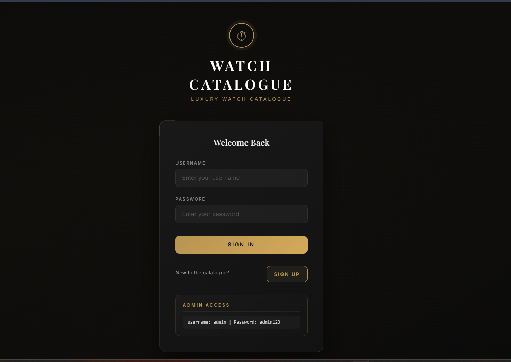
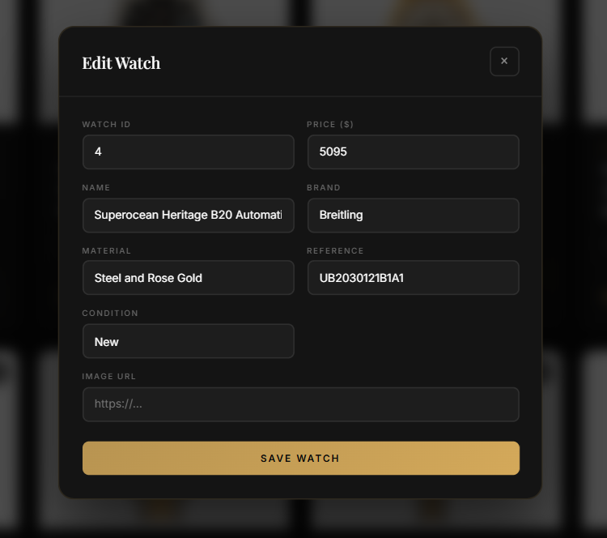

# Luxury Watch Catalogue Web App

## Overview

A full-stack web application built with Python Flask that provides a comprehensive platform for browsing and managing a luxury watch catalogue. This application enables users to explore an extensive collection of watches, manage personal wishlists, and receive personalized recommendations, while administrators can oversee and maintain the catalogue.

## Note

Some product images were removed due to copyright considerations. The application functionality remains fully intact. I will be fixing this shortly. 

## Features

- **Role-Based Access Control**: Secure authentication system with distinct Admin and User roles
- **User Authentication**: Complete login, signup, and logout functionality
- **Wishlist Management**: Full CRUD operations for personal watch collections
- **Recommendation System**: Intelligent similar watch suggestions based on user preferences
- **Advanced Sorting**: Sort watches by price, brand, model, and other criteria
- **Search & Filtering**: Powerful search capabilities with multiple filter options
- **Error Handling**: Robust error handling with graceful failure management
- **User Experience Enhancements**: Interactive tooltips and responsive design
- **Full-Stack Integration**: Seamless integration between Flask backend and Jinja2 frontend

## Tech Stack

- **Backend**: Python, Flask
- **Frontend**: HTML, CSS, Jinja2 Templates
- **Data Storage**: CSV-based data management
- **Authentication**: Flask session-based authentication
- **Development Tools**: Git, GitHub

## Installation & Setup

### Prerequisites
- Python 3.8 or higher
- pip package manager

### Steps

1. **Clone the Repository**
   ```bash
   git clone https://github.com/ShaikhFawzan/Luxury-Watch-Catalogue-Web-App.git
   cd Luxury-Watch-Catalogue-Web-App
   ```

2. **Create Virtual Environment** (Recommended)
   ```bash
   python -m venv venv
   source venv/bin/activate  # On Windows: venv\Scripts\activate
   ```

3. **Install Dependencies** 
   ```bash
   pip install -r requirements.txt
   ```

4. **Run the Application**
   ```bash
   # On Windows
   .\scripts\build.bat
   
   # On Linux/Mac
   ./scripts/build.sh
   ```

5. **Access the Application**
   Open your browser and navigate to `http://localhost:5000`

## Usage

### For Users
- **Browse Catalogue**: Explore the complete watch collection with sorting and filtering options
- **Search**: Use the search functionality to find specific watches
- **Wishlist**: Add/remove watches from your personal wishlist
- **Recommendations**: View similar watch suggestions
- **Authentication**: Register, login, and manage your account

### For Administrators
- **Catalogue Management**: Add, edit, and remove watches from the database

#### Possible Future Additions
- **User Oversight**: Monitor user activities and manage accounts
- **System Maintenance**: Access administrative tools and reports

## Project Structure

```
Watch-Catalogue-Project-/
├── app.py                 # Main Flask application
├── backend.py             # Backend logic and utilities
├── test_backend.py        # Backend unit tests
├── test_frontend.py       # Frontend integration tests
├── users.csv              # User data storage
├── watches.csv            # Watch catalogue data
├── testdata.csv           # Test data
├── templates/             # Jinja2 HTML templates
│   ├── catalogue.html
│   └── login.html
├── scripts/               # Build and deployment scripts
│   ├── build.bat
│   └── build.sh
├── Diagrams/              # UML and design diagrams
└── old_stuff/             # Legacy code and archives
```

## My Contributions

Led development of key features and core functionality in a team-based full-stack application:

- **Leadership & Design**: Collaborated with a team and designed comprehensive UML diagrams including class diagrams and sequence diagrams
- **Core Features Implementation**:
  - Advanced sorting system for flexible catalogue browsing
  - Intelligent recommendation engine for similar watch suggestions
  - Complete wishlist functionality with full CRUD operations
- **Full-Stack Development**: Implemented both backend logic (Flask routes and APIs) and frontend integration (Jinja2 templates)
- **System Integration**: Ensured seamless integration of all features across backend and frontend components

## Screenshots

### Login Page


### Watch Catalogue


### Admin Panel (Edit Watch)


### Search, Filter, and Sort Functionality


## Future Improvements

- **Database Migration**: Transition from CSV to a robust database system (PostgreSQL/MySQL)
- **Enhanced Security**: Implement JWT-based authentication and improved password hashing
- **API Development**: Create RESTful APIs for mobile app integration
- **Advanced Analytics**: Add user behavior tracking and recommendation algorithm refinements
- **UI/UX Enhancements**: Implement modern frontend framework (React/Vue.js) for improved interactivity

---

*Built with passion for luxury watches and clean code architecture.*
