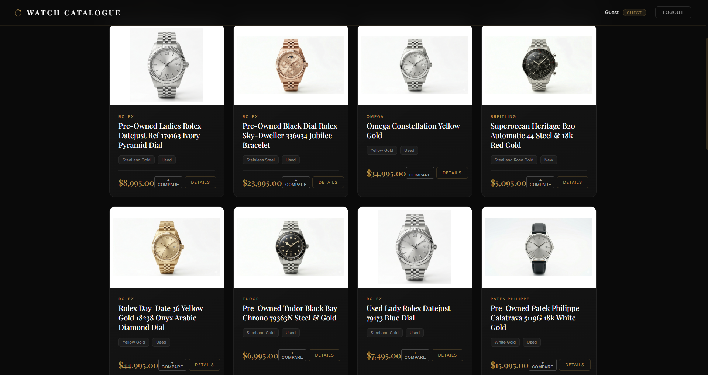

# Luxury Watch Catalogue Web App

### A Full-Stack Luxury Watch Browsing & Management Platform

> Project is feature-complete. Final testing and documentation improvements are in progress.

## Overview

A full-stack web application built with **Python (Flask)** for browsing, managing, and discovering luxury watches through a curated luxury watch catalogue. The system supports role-based access control, persistent user data, and dynamic catalogue interactions including wishlists and review systems.

The project demonstrates full-stack development, backend database migration, and scalable application design using modern deployment practices.

## Live Demo
[Launch Application](https://luxury-watch-catalogue-web-app.onrender.com)   

## Features

- Full-stack web development using **Python, Flask, HTML, CSS, Jinja2**
- Role-based authentication system (**Admin / User / Guest**)
- Search, filtering, and sorting across 600+ watch entries
- Wishlist system with full CRUD functionality and user-specific data
- Watch comparison feature with focus on clean, intuitive layout
- Watch review system with ratings and timestamps
- Recommendation engine for similar watches
- Admin dashboard for managing catalogue entries (CRUD)
- Cloud database integration (Supabase) for persistent data storage
- Deployed production-ready application on Render

---

## Core functionality

### User Features
- Secure signup and login system
   - Optional guest functionality with read-only access
- Browse and search complete watch catalogue with over 600 watches
- Sort by price, brand, and model

### Admin Features
- Add, edit, and delete watch entries
- Maintain structured catalogue data
- Full CRUD control over inventory system

### Catalogue Features
- Browse full watch inventory
- Search by brand, model, or keyword
- Filter by price, material, condition, and brand
- Sort dynamically (price, brand, condition, etc.)
- View detailed watch pages with recommendations

### Wishlist System
- Add/remove watches from personal wishlist
- Persistent storage tied to user accounts
- Real-time session synchronization

### Reviews System
- Users can submit and edit reviews per watch
- Ratings (1–5 scale) with timestamps
- Admin-visible aggregated review data

---
### Technical Highlights
- Flask backend with modular architecture
- Supabase PostgreSQL database integration (replacing CSV storage)
- Secure password hashing using Werkzeug
- Session-based authentication and role control
- REST-style API endpoints for frontend interaction
- Dynamic Jinja2 templating system
- Deployment via Render with environment variables
- Input validation and error handling across all forms
---

## Tech Stack

| Category | Technologies |
|--------|-------------|
| Backend | Python, Flask |
| Frontend | HTML, CSS, Jinja2 |
| Database | Supabase (PostgreSQL) |
| Authentication | Flask Sessions, Werkzeug |
| Deployment | Render |
| Tools | Git, GitHub |

---

## Project Structure

```
Luxury-Watch-Catalogue-Web-App/

├── Diagrams/                      # UML and design diagrams
│   └── UML_Diagram.pdf
├── scripts/                       # Build and deployment scripts
│   ├── build.bat
│   └── build.sh
├── static/                        # Static assets
│   └── images/                    # Images and media files
│       ├── adminEdit.png
│       ├── catalogue.png
│       ├── login.png
│       ├── tools/
│       │   └── image_mapper.py    # Map each watch to an image
│       └── watches/               # Watch images
├── templates/                     # Jinja2 HTML templates
│   ├── catalogue.html
│   └── login.html
├── .gitignore                     # Git ignore file
├── LICENSE                        # Project license
├── Procfile                       # Deployment file
├── README.md                      # Project documentation
├── app.py                         # Main Flask application
├── backend.py                     # Backend logic and utilities
└── requirements.txt               # Dependencies
```

## My Contributions

As part of a 5-person university development team, I contributed significantly to the design, development, and deployment of the full-stack application.

### Full-Stack Development
- Developed core backend logic using Flask and integrated it with frontend Jinja templates
- Connected dynamic catalogue data to responsive UI components, for real-time browsing and filtering
- Contributed to system-wide debugging, integration, and feature coordination to ensure stable full-stack functionality
- Contributed to overall application architecture and backend/frontend integration
### Data Persistence & Backend Migration
- Migrated the application from CSV-based storage to a cloud-hosted PostgreSQL database using Supabase
- Designed and implemented secure database operations including `select`, `insert`, `update`, and `delete` workflows
- Structured relational data handling for users, watches, and reviews to ensure consistency
- Resolved deployment persistence issues by transitioning to cloud-based storage on Render
### Core Features Implemented
- Built advanced catalogue sorting and filtering system
- Assisted with development of persistent wishlist functionality with full add/remove functionality tied to user sessions and database storage
- Implemented recommendation engine based on watch attribute similarity
### Authentication & Session Management   
- Implemented secure user authentication system using Flask sessions and role-based access control (User/Admin/Guest)
- Integrated password hashing using Werkzeug security functions
- Added Flask flash messaging system for user feedback (login errors, signup validation, and success states)
- Developed guest access mode with restricted permissions for read-only catalogue browsing
### Software Design & Collaboration
- Designed UML class and sequence diagrams to support system architecture planning and implementation
- Worked in an Agile-style development environment with iterative feature delivery and peer code reviews
- Contributed to debugging, refactoring, and integration of backend and frontend systems across the full stack

---

## What I Learned

- Building and deploying full-stack web applications from scratch
- Backend-to-database migration (CSV → PostgreSQL)
- Authentication, session management, and security practices
- Working in a multi-person collaborative codebase
- Debugging and integrating shared components
- Translating software designs into working features

---

## Screenshots

### Login Page


### Watch Catalogue


### Admin Panel (Edit Watch)


## Installation & Setup

### Prerequisites
- **Python 3.8 or higher** (tested with Python 3.9+)
- **pip** package manager (comes with Python)
- **Git** for cloning the repository
- **Supabase account** (free tier available at https://supabase.com)
  - You'll need: Supabase URL and API Key

### Steps

1. **Clone the Repository**
   ```bash
   git clone https://github.com/ShaikhFawzan/Luxury-Watch-Catalogue-Web-App.git
   cd Luxury-Watch-Catalogue-Web-App
   ```

2. **Create Virtual Environment** (Recommended)
   ```bash
   python -m venv venv

   # On Linux/macOS
   source venv/bin/activate
   
   # On Windows (Command Prompt):
   venv\Scripts\activate

   # On Windows (PowerShell)
   venv\Scripts\Activate.ps1
   ```

3. **Configure Environment Variables**
   
   Create a `.env` file in the root directory with the following variables:
   ```
   SUPABASE_URL=your_supabase_url_here
   SUPABASE_KEY=your_supabase_api_key_here
   SECRET_KEY=your_secret_key_here
   ```
   
   **Where to find these:**
   - **SUPABASE_URL** and **SUPABASE_KEY**: Found in your Supabase project settings (Settings → API → Project URL and anon public key)
   - **SECRET_KEY**: Generate a random string (e.g., using `python -c "import secrets; print(secrets.token_hex(16))"` in terminal)

4. **Install Dependencies** 
   ```bash
   pip install -r requirements.txt
   ```
   
   This installs all required packages:
   - Flask
   - Supabase Python client
   - python-dotenv
   - Werkzeug (security utilities)

5. **Run the Application**
   ```bash
   python app.py
      # or
   flask run
   ```
   
   The application will start on `http://localhost:5000`

6. **Access the Application**
   
   Open your browser and navigate to `http://localhost:5000`
   
   **Default Test Accounts:**
   - Admin: `username: admin` | `password: admin123`
   - Regular User: `username: user` | `password: UserPassword123`
   - Or create a new account via the signup form

## Troubleshooting

### Common Issues & Solutions

| Issue | Fix |
|------|-----|
| Missing packages | Run `pip install -r requirements.txt` |
| Supabase connection error | Check `.env` credentials |
| Port 5000 in use | Run on another port |

---

 ## Image Notice
Watch images used in this project are AI-generated placeholder assets created for this project. 

They are not official manufacturer photos and are not intended to represent exact real-world models. Brand names and product data in the catalogue are used as sample inventory metadata.

## Future Improvements  

- **Enhanced Security**: Implement JWT-based authentication or OAuth
- **API Development**: Create API layer for mobile or frontend framework integration
- **Advanced Analytics**: Add user behavior tracking and recommendation algorithm refinements
- **UI/UX Enhancements**: Implement modern frontend framework (React/Vue.js) for improved interactivity
- **Testing**: Unit and integration testing with Pytest

---
